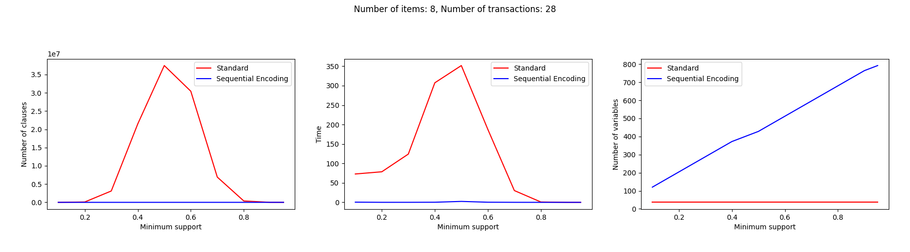
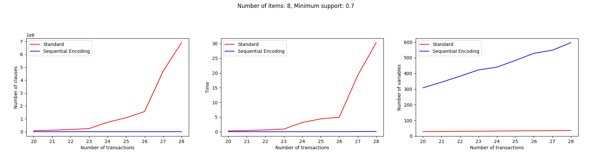

## Description

This project using Sequential Encounter Encoding to solve Itemset Mining Tasks, compare with standard SAT encoding C(n-k+1).




## Input

### Rule

Using `i*2+1` or `i*2` to represent the item i has been selected or not.
For example

```
@0: a = false @1: a = true
@2: b = false @3: b = true
@4: c = false @5: c = true
```

With the raw input:

```
a b c
0 1 0
0 0 1
```

You can use the command `cd input/ && python convert.py` to parse the input. Then it will be parsed to:

```
a b c
0 3 4
1 2 5
```

### Generate

For generate the input, you can use the command:

```
cd input/
python generate.py
```

### Dataset

Sample dataset:

- https://dtai.cs.kuleuven.be/CP4IM/datasets/
- http://fimi.uantwerpen.be/data/

## Build Kissat

This project using kissat as the SAT solver. So you need to build kissat first.

Clone the kissat repository from
https://github.com/arminbiere/kissat
and move the kissat folder to the root of this project.

Then build kissat by following command (only for the first time):

```
cd kissat
./configure && make test
```

## Run

### Run a single input

For run an input with selected solution, you can using `main.py`. Show the help message:

```
python main.py -h
```

### Benchmark

```
python benchmark.py
```
